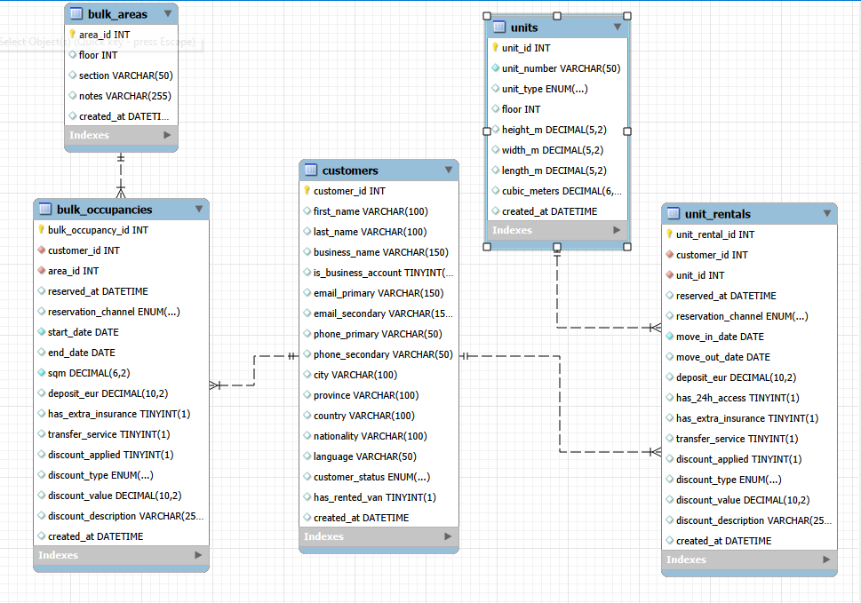

# 🗄️ Proyecto Personal – Sistema Analítico para Gestión de Trasteros

---

## 🎯 Objetivo del Proyecto

Este proyecto tiene un doble objetivo:

### 1️⃣ Académico (Bootcamp & Portfolio)

Proyecto final de un bootcamp de Data Analytics cuyo objetivo es:

- Diseñar un modelo relacional completo desde cero.
- Implementar un pipeline ETL reproducible en Python.
- Aplicar buenas prácticas de modelado, integridad y gobernanza de datos.
- Construir un proyecto end-to-end profesional para portfolio.

### 2️⃣ Profesional (Caso Real)

Proyecto desarrollado en colaboración con "Securistore Self-Storage", empresa real del sector de alquiler de trasteros.

Se ha diseñado una base de datos clara, mantenible y escalable que permite responder preguntas como:

- Distribución geográfica de clientes.
- Duración mínima, media y máxima de estancia.
- Ocupación actual y evolución temporal.
- Tiempo medio de vacancia por unidad.
- Segmentación entre clientes activos y finalizados.

⚠️ **Nota de privacidad:**  
Los datos publicados en este repositorio son sintéticos.  
Los datos reales se procesan únicamente en entorno local privado.

---

# 🏗 Arquitectura del Proyecto

El proyecto sigue una arquitectura **ETL batch basada en snapshots diarios**, priorizando:

- Trazabilidad
- Reproducibilidad
- Consistencia entre tablas
- Auditoría histórica

---

## 🔄 Flujo General

### 1️⃣ Extract
- Exportación de CSV desde el sistema operativo.
- Organización por fecha en:

  data/raw/YYYY-MM-DD/
---

### 2️⃣ Transform
Scripts independientes por entidad:

- `etl_units.py`
- `etl_customers.py`
- `etl_rentals.py`

Incluye:

- Limpieza de datos
- Normalización de estados
- Estandarización geográfica
- Validación estructural
- Detección de inconsistencias
- Generación de reportes auxiliares

---

### 3️⃣ Load
- Inserción / actualización mediante `INSERT ... ON DUPLICATE KEY UPDATE`
- Integridad referencial validada post-carga
- Claves externas basadas en `external_*_id`

---

### 4️⃣ Capa Analítica
- Base de datos MySQL consolidada
- Consultas SQL de verificación
- Preparado para herramientas BI (Tableau / Power BI)

---

# 📂 Estructura Real del Repositorio

00_STORAGE_PROJECT/
│
├── data/
│ ├── raw/
│ │ ├── 2026-01-27/
│ │ │ ├── rentals.csv
│ │ │ ├── types.csv
│ │ │ └── units.csv
│ │ │
│ │ ├── 2026-02-25/
│ │ │ ├── owners_customers.csv
│ │ │ └── rentals.csv
│ │ │
│ │ └── 2026-02-28/
│ │ ├── owners_customers.csv
│ │ ├── rentals.csv
│ │ └── units.csv
│ │
│ ├── processed/
│ │ ├── 2026-01-27/
│ │ │ └── units_clean.csv
│ │ │
│ │ ├── 2026-02-25/
│ │ │ ├── customers_clean.csv
│ │ │ ├── rentals_clean.csv
│ │ │ └── pending_country_review.csv
│ │ │
│ │ └── 2026-02-28/
│ │ ├── customers_clean.csv
│ │ ├── rentals_clean.csv
│ │ ├── units_clean.csv
│ │ ├── pending_country_review.csv
│ │ └── unit_state_mismatches.csv
│ │
│ ├── manual/
│ │ ├── 2026-02-25/
│ │ │ ├── monthly_customer.csv
│ │ │ └── monthly_rentals.csv
│ │ └── 2026-02-28/
│ │ ├── monthly_customer.csv
│ │ └── monthly_rentals.csv
│ │
│ └── reference/
│ ├── city_aliases.csv
│ ├── countries.csv
│ └── spanish_provinces.csv
│
├── images/
│ └── data_model.png
│
├── sql/
│ ├── Diagram.mwb
│ ├── 2026-02-28 Queries.sql
│ ├── Checks_01_03_2026.sql
│ ├── Data_Quality_Checklist_Snapshot_2026-02-28.sql
│ ├── Monthly_check.sql
│ ├── Unit_rentals_checks.sql
│ └── Revisiones.sql
│
├── src/
│ ├── etl_units.py
│ ├── etl_customers.py
│ └── etl_rentals.py
│
├── notebooks/
├── .env
├── .gitignore
├── README_ES.md
└── README_EN.md

---

# 🗄 Modelo de Datos

Base de datos: `storage_project`

### Tablas principales implementadas

- `customers`
- `units`
- `unit_rentals`

---

### Diagrama Entidad-Relación

Modelo EER diseñado en MySQL Workbench  
Archivo fuente disponible en: `sql/Diagram.mwb`

---

## 🧠 Decisiones de Diseño

En una fase inicial se consideró la creación de tablas agregadas:

- `bulk_areas`
- `bulk_occupancies`

Tras analizar la estructura real del sistema operativo, se determinó que:

- Toda la información necesaria ya estaba representada en:
  - `units`
  - `unit_rentals`

Se descartaron para evitar:

- Redundancia
- Complejidad innecesaria
- Riesgo de inconsistencias

El modelo final prioriza:

- Normalización
- Relaciones claras
- Integridad referencial estricta

---

# 🔄 Proceso ETL

Pipeline idempotente y re-ejecutable.

### Extract
- Lectura de snapshots fechados.

### Transform
- Limpieza y tipado
- Eliminación de duplicados
- Normalización geográfica
- Inferencia automática de país cuando provincia española
- Export de inconsistencias:
  - `pending_country_review.csv`
  - `unit_state_mismatches.csv`

### Load
- UPSERT en MySQL
- Verificaciones SQL posteriores

---

# 🛡 Calidad de Datos y Limitaciones Conocidas

## 1️⃣ Consistencia por Snapshots

El pipeline debe ejecutarse en orden:

1. `etl_units.py`
2. `etl_customers.py`
3. `etl_rentals.py`

Ejecuciones parciales pueden generar inconsistencias temporales.

---

## 2️⃣ Clientes Mensuales

En el sistema operativo:

- Las unidades mensuales aparecen como `blocked`.

En el modelo analítico:

- Se consideran `occupied`.

Snapshot `2026-02-28`:
- 12 unidades mensuales
- 1 unidad bloqueada de prueba

---

## 3️⃣ Desajustes unit_state vs rental_state (4 casos)

Unidades marcadas como `available` cuyo último rental figura como `occupied`.

Documentado en:
data/processed/2026-02-28/unit_state_mismatches.csv

No se aplican correcciones artificiales.

---

## 4️⃣ Datos de Localización Faltantes

2 clientes activos sin `city` ni `province`.

- Información no proporcionada
- Valores preservados como `NULL`

---

# 🧹 Gobernanza de Datos

- Eliminación completa de PII
- Snapshots versionados
- Integridad referencial validada
- Documentación de anomalías
- Modelo reproducible

---

# 📊 Próxima Fase: Análisis y Visualización

El modelo está preparado para:

- Análisis de ocupación
- Tiempo medio sin ocupar
- Segmentación geográfica
- Evolución temporal
- Comportamiento de clientes recurrentes

## Capa Analítica (Vista SQL para BI)

Además del pipeline ETL en Python, se creó una vista analítica en MySQL (`analytics_rentals`).

Esta vista:
- Enriquece los datos de alquiler con información de unidades y clientes
- Calcula dinámicamente la duración del alquiler
- Identifica alquileres activos
- Detecta clientes con múltiples unidades
- Calcula los m² totales ocupados por cliente

Esta vista funciona como capa semántica para Tableau, permitiendo conexión directa a la base de datos en lugar de trabajar únicamente con CSV.

La arquitectura separa:
- Datos raw
- Datos procesados
- Capa analítica
- Capa de visualización

Refleja un flujo de trabajo orientado a entorno profesional.

Próximo paso:

- Construcción de dashboards en Tableau / Power BI
- Integración de identidad visual corporativa

---

# 🛠 Stack Tecnológico

- MySQL
- Python
- pandas
- SQLAlchemy
- python-dotenv
- Tableau (fase analítica)
- Power BI (opcional)

---

# 🚀 Estado Actual

✔ Modelo relacional implementado  
✔ ETL operativo  
✔ Snapshots automatizados  
✔ Calidad de datos validada  
✔ Integridad referencial comprobada  
✔ Listo para fase analítica  

Phase 1: Operational & occupancy analysis
Phase 2: Financial and revenue optimization analysis